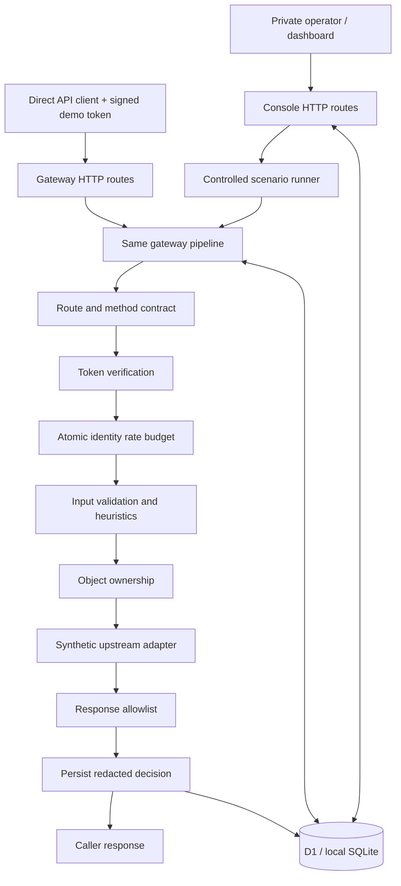

# Architecture and design decisions

## Request lifecycle

The router exposes only configured methods and paths. Unknown routes are
rejected and recorded using a normalized `unregistered` label, not the raw URL.
All registered routes require a valid bearer token. Token identity comes only
from a verified signature and claims, never a body field or forwarded header.

The gateway consumes a shared identity budget, validates the request, applies
the heuristic, and checks ownership where applicable. The synthetic upstream
has no directly exposed bypass route. Response contracts run before returning
the body. Each decision receives a UUID also returned as
`X-Sentinel-Request-Id`; `X-Sentinel-Action` names the enforcement outcome.

Authentication, ownership, and request contracts are mandatory. Editable rules
have `block` and `monitor` modes. For the response rule, `block` means filtering
fields. Multiple findings can accompany one request; a response can be filtered
while also containing a monitored request finding.

## Atomic rate control

The limiter uses one `INSERT ... ON CONFLICT DO UPDATE ... RETURNING count`
statement. Counting and incrementing are one database operation; concurrent
requests cannot all read the same old value. The live key is the verified
identity shared across all registered endpoints. Windows are aligned to UTC
minutes. A fixed window can admit up to twice the budget across a boundary;
production systems may prefer a sliding window or token bucket.

Scenarios get a server-generated namespace to keep experiments repeatable and
independent of live budgets. Client-supplied headers cannot choose a namespace.
The burst submits 14 concurrent requests to the same pipeline. Temporary
scenario rate rows are deleted after completion; events are retained. The
console scenario trigger itself is capped at 30 invocations per minute.

## Persistence and event minimization

Five tables store policies, events, counters, audit entries, and server-only
settings. Queries use prepared parameters; policy update and its audit record
are one database batch. Runtime initialization inserts missing default policy
rows but never creates or alters schema. Drizzle migrations own schema changes.

The events table records normalized endpoints, verified synthetic identities,
status, action, evaluation duration, and safe rule evidence. It does not store
bearer tokens, queries, request bodies, or raw response data. Audit reasons are
operator-provided text; operators should not paste secrets into them.

The signing key is 32 cryptographically random bytes, inserted once using a
unique settings key. Concurrent initialization retains one key. It never leaves
server code. For a production deployment, move this key to managed secret
storage and define rotation/key identifiers; database administrators currently
have access to it. Removing this setting rotates the key on reinitialization
and invalidates outstanding demo tokens.

If storage or the limiter fails, the route returns 503 and does not return an
upstream response. The synthetic adapter has no durable side effects. A real
upstream adapter will need idempotency and an outbox/transaction strategy for
failures after an upstream mutation.

## UI and explain/replay

The browser polls durable state every three seconds while visible. Metrics are
derived from persisted events; no random traffic or preloaded fake alerts are
used. The chart displays the last 30 minutes. The table displays the newest 100
events, with client-side action/search filters over that bounded set. Aggregate
counters cover all retained records. The audit panel shows the latest 30 entries.

An event drawer explains each finding and the mode that applied at evaluation
time. Reviewing adds an audit entry. Replay regenerates a predefined synthetic
scenario under current policies, rather than storing/replaying sensitive raw
requests. Direct requests cannot be replayed from the redacted event alone.

An optional browser WebMCP tool calls the same scenario action and updates the
playground. Unsupported browsers omit this feature. It is not a security boundary.

## Extending the prototype

1. Add independently authenticated operators and role-based policy permissions.
2. Replace the synthetic adapter with a fixed, configured upstream. Do not accept
   arbitrary target URLs; isolate upstream access to prevent bypass and SSRF.
3. Replace the demo issuer with an established identity provider and cached JWKS.
4. Load endpoint schemas from reviewed OpenAPI specifications and enforce
   application-specific authorization using authoritative resource data.
5. Add edge-level anonymous/IP quotas, event retention, sampled telemetry, and
   load testing before claiming high-volume or DDoS protection.

## Reference decisions

- Ownership checks use authoritative server records, consistent with
  [OWASP API1:2023](https://owasp.org/API-Security/editions/2023/en/0xa1-broken-object-level-authorization/).
- Request and response properties are explicit contracts. Coverage labels refer
  to the [OWASP API Security project](https://owasp.org/www-project-api-security/),
  not a claim of complete Top 10 coverage.
- Prepared statements and batches follow
  [Cloudflare D1's API](https://developers.cloudflare.com/d1/worker-api/d1-database/).
